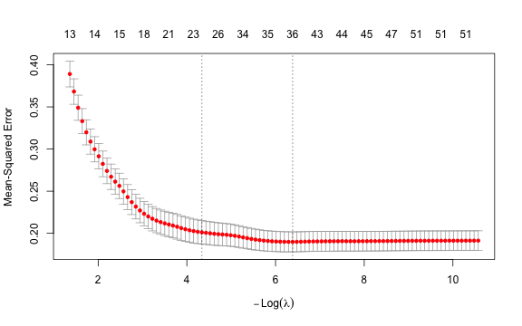

## Scope and interpretation

This is a sensitivity run based on the LASSO portion of
`CA_FL_EDA_Graphs_COMPLETE_UPDATED (1).Rmd`. It keeps the template's logged
target, nine predictor transformations, 38 penalized candidate predictors, and
10-fold cross-validation. The sole specification change is that the original
linear `control_time_index` is replaced by a categorical `predictor_year`
control. The state control and every year dummy are unpenalized.

This is **not an out-of-time predictive result**. A future held-out year has no
estimated fixed-effect coefficient, so categorical years cannot be used for
the project's rolling-origin evaluation without an unsupported extrapolation.
The random-fold CV reported here is useful only as a within-observed-years,
associational sensitivity check; it must not replace the audited FINAL rolling
LASSO results.

## Input validation


``` r
suppressPackageStartupMessages({
  library(readxl)
  library(dplyr)
  library(glmnet)
  library(ggplot2)
})

input_path <- file.path("..", "lasso_model", "CA_FL_LASSO_MODEL_INPUT_v2.xlsx")
expected_md5 <- "5d3fd16b32c687e5207ea59c902e7bef"

if (!file.exists(input_path)) stop("Model input not found: ", normalizePath(input_path, mustWork = FALSE))
actual_md5 <- unname(tools::md5sum(input_path))
if (!identical(actual_md5, expected_md5)) stop("Input MD5 mismatch. Expected ", expected_md5, "; got ", actual_md5)

data_all <- as.data.frame(read_excel(input_path, sheet = "LASSO Model Data"))
target <- "target_homeless_rate_per_10k"
state_control <- "control_state_florida"
year_control <- "predictor_year"
id_cols <- c("state", "state_abbr", "coc_number", "coc_name", "predictor_year", "target_year")

if (nrow(data_all) != 887L || length(unique(data_all$coc_number)) != 70L) stop("Unexpected panel shape: expected 887 rows across 70 CoCs.")
required_cols <- c(id_cols, target, state_control, "control_time_index")
missing_cols <- setdiff(required_cols, names(data_all))
if (length(missing_cols) > 0L) stop("Missing required columns: ", paste(missing_cols, collapse = ", "))

data.frame(rows = nrow(data_all), cocs = length(unique(data_all$coc_number)), predictor_years = length(unique(data_all$predictor_year)), input_md5 = actual_md5)
```

```
##   rows cocs predictor_years                        input_md5
## 1  887   70              13 5d3fd16b32c687e5207ea59c902e7bef
```

## Transformations and design matrix


``` r
log_vars <- c(
  "coc_population_density_per_sq_mile", "coc_real_gdp_per_capita_2017_usd",
  "coc_hic_psh_beds_per_10k", "coc_hic_temporary_beds_per_10k",
  "coc_permits_per_1000_housing_units", "coc_permits_value_per_1000_housing_units_2025_usd",
  "coc_real_median_household_income_2025_usd", "coc_real_per_capita_personal_income_2025_usd",
  "coc_relative_home_price_index_2000_base"
)

predictors <- setdiff(names(data_all), c(id_cols, target, state_control, "control_time_index"))
if (length(predictors) != 38L) stop("Expected 38 candidate predictors; found ", length(predictors))

fit_data <- data_all[, c(target, state_control, year_control, predictors)]
numeric_model_cols <- setdiff(names(fit_data), year_control)
if (any(!is.finite(as.matrix(fit_data[, numeric_model_cols])))) stop("NA, NaN, or Inf detected in the target, state control, or predictors.")

data_log <- fit_data
for (v in log_vars) data_log[[v]] <- if (min(data_log[[v]]) > 0) log(data_log[[v]]) else log1p(data_log[[v]])
if (any(data_log[[target]] <= 0)) stop("Target must be strictly positive.")
data_log[[target]] <- log(data_log[[target]])

# 2011 is the reference category. The other 12 available predictor years are
# unpenalized fixed-effect controls.
data_log$predictor_year_factor <- factor(data_log[[year_control]], levels = sort(unique(data_log[[year_control]])))
data_log[[year_control]] <- NULL

Y <- data_log[[target]]
X <- model.matrix(target_homeless_rate_per_10k ~ ., data = data_log)[, -1, drop = FALSE]
year_dummy_cols <- grep("^predictor_year_factor", colnames(X), value = TRUE)
unpenalized_controls <- c(state_control, year_dummy_cols)
pf <- ifelse(colnames(X) %in% unpenalized_controls, 0, 1)

if (ncol(X) != 51L || length(year_dummy_cols) != 12L || sum(pf == 0) != 13L || sum(pf == 1) != 38L) stop("Unexpected categorical-year design matrix or penalty factors.")
data.frame(design_columns = ncol(X), penalized_predictors = sum(pf == 1), unpenalized_controls = sum(pf == 0), categorical_year_indicators = length(year_dummy_cols), year_reference = levels(data_log$predictor_year_factor)[1])
```

```
##   design_columns penalized_predictors unpenalized_controls
## 1             51                   38                   13
##   categorical_year_indicators year_reference
## 1                          12           2011
```

## Multiple regression with categorical year controls

This is the matching full OLS specification: all 38 substantive predictors,
the Florida control, and the 12 categorical predictor-year indicators enter at
once. The year indicators use 2011 as the reference category. As in the
template, this model is descriptive; its coefficient p-values are especially
fragile because the predictors are strongly correlated and the same data are
used for model specification and estimation.


``` r
fit_ols_categorical_year <- lm(
  target_homeless_rate_per_10k ~ ., 
  data = data_log
)

ols_summary <- summary(fit_ols_categorical_year)
ols_coefficients <- data.frame(
  term = rownames(ols_summary$coefficients),
  estimate = ols_summary$coefficients[, "Estimate"],
  std_error = ols_summary$coefficients[, "Std. Error"],
  t_value = ols_summary$coefficients[, "t value"],
  p_value = ols_summary$coefficients[, "Pr(>|t|)"],
  row.names = NULL
)

ols_fit_summary <- data.frame(
  observations = nobs(fit_ols_categorical_year),
  estimated_coefficients = fit_ols_categorical_year$rank,
  residual_df = df.residual(fit_ols_categorical_year),
  r_squared_log_scale = ols_summary$r.squared,
  adjusted_r_squared_log_scale = ols_summary$adj.r.squared,
  residual_standard_error_log_scale = ols_summary$sigma,
  f_statistic = unname(ols_summary$fstatistic[1]),
  f_numerator_df = unname(ols_summary$fstatistic[2]),
  f_denominator_df = unname(ols_summary$fstatistic[3]),
  f_p_value = pf(
    ols_summary$fstatistic[1],
    ols_summary$fstatistic[2],
    ols_summary$fstatistic[3],
    lower.tail = FALSE
  )
)

write.csv(ols_fit_summary, "categorical_year_ols_fit_summary.csv", row.names = FALSE)
write.csv(ols_coefficients, "categorical_year_ols_coefficients.csv", row.names = FALSE)

knitr::kable(ols_fit_summary, digits = 5)
```


|      | observations| estimated_coefficients| residual_df| r_squared_log_scale| adjusted_r_squared_log_scale| residual_standard_error_log_scale| f_statistic| f_numerator_df| f_denominator_df| f_p_value|
|:-----|------------:|----------------------:|-----------:|-------------------:|----------------------------:|---------------------------------:|-----------:|--------------:|----------------:|---------:|
|value |          887|                     52|         835|             0.66241|                      0.64179|                           0.42283|     32.1252|             51|              835|         0|

The full coefficient table is saved beside this report. The table below shows
the ten smallest nominal p-values only; it is a readability aid, not evidence
of causal or confirmatory effects.


``` r
ols_top_terms <- ols_coefficients %>%
  filter(term != "(Intercept)") %>%
  arrange(p_value) %>%
  slice_head(n = 10)
knitr::kable(ols_top_terms, digits = 5)
```


|term                                         | estimate| std_error|  t_value| p_value|
|:--------------------------------------------|--------:|---------:|--------:|-------:|
|coc_hic_temporary_beds_per_10k               |  0.36864|   0.03731|  9.87948| 0.00000|
|coc_hic_psh_beds_per_10k                     |  0.21332|   0.02684|  7.94848| 0.00000|
|coc_real_gdp_per_capita_2017_usd             | -0.62013|   0.12420| -4.99286| 0.00000|
|coc_log_estimated_population                 | -0.10092|   0.02420| -4.17055| 0.00003|
|coc_homeownership_rate_pct                   | -0.02383|   0.00629| -3.78613| 0.00016|
|coc_real_per_capita_personal_income_2025_usd |  0.63035|   0.18578|  3.39298| 0.00072|
|coc_housing_cost_burdened_households_pct     | -0.01983|   0.00638| -3.10878| 0.00194|
|coc_housing_units_per_1000_residents         |  0.00129|   0.00044|  2.95830| 0.00318|
|state_real_minimum_wage_2025_usd             |  0.19253|   0.07070|  2.72328| 0.00660|
|coc_poverty_child_pct                        | -0.03012|   0.01109| -2.71466| 0.00677|

## 10-fold cross-validated LASSO


``` r
set.seed(10)
fit_cv <- cv.glmnet(x = X, y = Y, alpha = 1, nfolds = 10, intercept = TRUE, penalty.factor = pf)
fit_min <- glmnet(x = X, y = Y, alpha = 1, lambda = fit_cv$lambda.min, penalty.factor = pf)
fit_1se <- glmnet(x = X, y = Y, alpha = 1, lambda = fit_cv$lambda.1se, penalty.factor = pf)

coef_table <- function(fit, rule) {
  out <- as.matrix(coef(fit))
  data.frame(term = rownames(out), coefficient = as.numeric(out[, 1]), lambda_rule = rule, row.names = NULL)
}
coefs <- bind_rows(coef_table(fit_min, "lambda.min"), coef_table(fit_1se, "lambda.1se"))
selected_predictors <- coefs %>% filter(term %in% predictors, coefficient != 0) %>% arrange(lambda_rule, desc(abs(coefficient)))
cv_summary <- data.frame(
  lambda_rule = c("lambda.min", "lambda.1se"),
  lambda = c(fit_cv$lambda.min, fit_cv$lambda.1se),
  cv_mse_log_scale = c(min(fit_cv$cvm), fit_cv$cvm[which.min(abs(fit_cv$lambda - fit_cv$lambda.1se))]),
  selected_candidate_predictors = c(
    sum(coefs$lambda_rule == "lambda.min" & coefs$term %in% predictors & coefs$coefficient != 0),
    sum(coefs$lambda_rule == "lambda.1se" & coefs$term %in% predictors & coefs$coefficient != 0)
  )
)
write.csv(cv_summary, "categorical_year_cv_summary.csv", row.names = FALSE)
write.csv(coefs, "categorical_year_coefficients.csv", row.names = FALSE)
write.csv(selected_predictors, "categorical_year_selected_predictors.csv", row.names = FALSE)
knitr::kable(cv_summary, digits = 5)
```


|lambda_rule |  lambda| cv_mse_log_scale| selected_candidate_predictors|
|:-----------|-------:|----------------:|-----------------------------:|
|lambda.min  | 0.00169|          0.18984|                            23|
|lambda.1se  | 0.01306|          0.20115|                            11|


``` r
plot(fit_cv)
```



## Selected candidate predictors

Year fixed effects and the Florida control are intentionally excluded below:
they are unpenalized adjustment variables, not substantive selections.


``` r
knitr::kable(selected_predictors, digits = 5)
```


|term                                              | coefficient|lambda_rule |
|:-------------------------------------------------|-----------:|:-----------|
|coc_hic_temporary_beds_per_10k                    |     0.43577|lambda.1se  |
|coc_hic_psh_beds_per_10k                          |     0.15611|lambda.1se  |
|coc_log_estimated_population                      |    -0.13554|lambda.1se  |
|state_medicaid_expansion                          |     0.12680|lambda.1se  |
|coc_permits_value_per_1000_housing_units_2025_usd |    -0.07732|lambda.1se  |
|state_real_minimum_wage_2025_usd                  |     0.03396|lambda.1se  |
|coc_population_density_per_sq_mile                |    -0.01395|lambda.1se  |
|coc_real_per_capita_personal_income_2025_usd      |     0.00656|lambda.1se  |
|coc_contains_split_county_flag                    |    -0.00305|lambda.1se  |
|coc_housing_units_per_1000_residents              |     0.00095|lambda.1se  |
|coc_group_quarters_per_1000_residents             |     0.00053|lambda.1se  |
|coc_real_gdp_per_capita_2017_usd                  |    -0.40272|lambda.min  |
|coc_hic_temporary_beds_per_10k                    |     0.37832|lambda.min  |
|coc_real_per_capita_personal_income_2025_usd      |     0.34275|lambda.min  |
|coc_hic_psh_beds_per_10k                          |     0.19641|lambda.min  |
|coc_log_estimated_population                      |    -0.11318|lambda.min  |
|coc_permits_value_per_1000_housing_units_2025_usd |    -0.10190|lambda.min  |
|state_real_minimum_wage_2025_usd                  |     0.09905|lambda.min  |
|coc_population_density_per_sq_mile                |    -0.05908|lambda.min  |
|state_rental_vacancy_rate                         |     0.05512|lambda.min  |
|coc_relative_home_price_index_2000_base           |     0.05388|lambda.min  |
|state_medicaid_expansion                          |     0.04469|lambda.min  |
|coc_death_rate_per_1000                           |     0.03057|lambda.min  |
|coc_homeownership_rate_pct                        |    -0.01969|lambda.min  |
|coc_poverty_child_pct                             |    -0.01916|lambda.min  |
|coc_unemployment_rate_pct                         |     0.01489|lambda.min  |
|coc_housing_cost_burdened_households_pct          |    -0.01111|lambda.min  |
|coc_real_gdp_quantity_index                       |     0.00527|lambda.min  |
|coc_high_school_graduate_pct                      |    -0.00379|lambda.min  |
|coc_contributing_counties                         |    -0.00338|lambda.min  |
|coc_international_migration_rate_per_1000         |     0.00315|lambda.min  |
|coc_multifamily_permit_share_pct                  |     0.00146|lambda.min  |
|coc_housing_units_per_1000_residents              |     0.00109|lambda.min  |
|coc_group_quarters_per_1000_residents             |     0.00049|lambda.min  |

## Reproducibility note

The three CSV files beside this report are derived from the audited v2 input
whose MD5 is checked above. Coefficients are predictive associations and, in
this random-fold sensitivity design, are not causal effects or out-of-time
performance estimates.
